## A Procedural Method for Remembering Key Signatures

by u/physicsstudent137

### Motivation

The purpose of this is as an aid to help people who enjoy finding patterns to identify and remember the major key signatures.

I was once told the following two "shortcuts" for remembering the key signatures:

- For flat key signatures, the tonic of the major key is the second-to-last recently added flat note (except for F Major, which just has one flat).
- For sharp key signatures, the tonic of the major key is the last most recently added sharp note plus one semitone.

I had a few problems with these shortcuts:

- They both seemed arbitrary and disjointed, especially since the flat key signatures have the exception of F major with 1 flat.
- In order to use these tricks, you need to visually see the key signature with the added accidentals on the staff in front of you, or you need to remember the order of the added sharps or flats, and then backtrack mentally (which is tough for me to do quickly).
- These tricks don't provide any intuition into the nature of the circle of fifths.

### The Procedure

#### Accidentals count, a, to major-key tonic note, n

How to get the tonic note of each major key signature:

1. Is the number of accidentals in the key signature even or odd?
   - If even: start at the note C
   - If odd: start at the note F♯ / G♭
2. Are the accidentals sharps or flats?
   - If sharps: go up that number of semitones
   - If flats: go down that number of semitones
3. If necessary, disambiguate between enharmonic equivalent notes (for example F♯ / G♭). Are the accidentals sharps or flats?
   - If sharps: the note is the sharp enharmonic label
   - If flats: the note is the flat enharmonic label

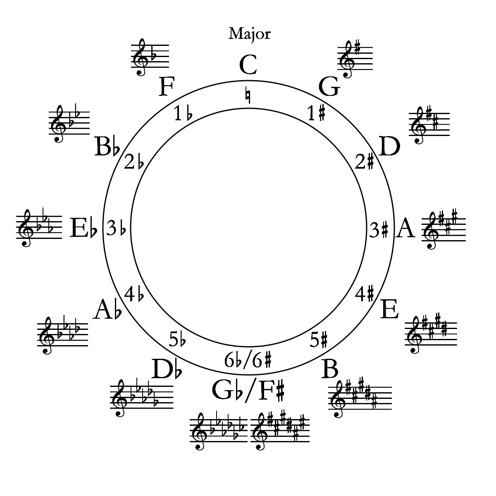
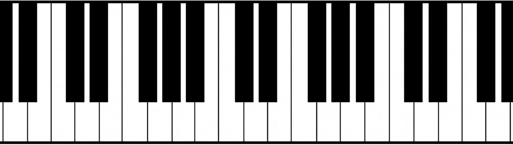

Reference circle of fifths and piano

Example: which major key has 3 flats?

1. 3 flats is odd, so start at note F♯ / G♭.
2. 3 flats, so go down 3 semitones from F♯ / G♭.
3. This is note E♭ / D♯. The key signature is comprised of flats, so the proper enharmonic label to choose is also flat: E♭ major.

#### Major-key tonic note, n, to accidentals count, a

Number the 12 notes of the octave starting with C = 0.

| Number | Note    |
| ------ | ------- |
| 0      | C       |
| 1      | C♯ / D♭ |
| 2      | D       |
| 3      | D♯ / E♭ |
| 4      | E       |
| 5      | F       |
| 6      | F♯ / G♭ |
| 7      | G       |
| 8      | G♯ / A♭ |
| 9      | A       |
| 10     | A♯ / B♭ |
| 11     | B       |

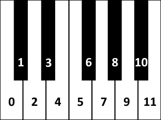

Piano note numbering

This trick can be done by simply visualizing the distances on a piano or by memorizing the numbers corresponding to each note above and doing the arithmetic.

Let `n` be the note number and `a` be the number of accidentals in that note's major key.

1. Pick a note.
2. If `n` is even and `n ≥ 6`, then `a = n - 12`. If `n` is even and `n ≤ 6`, then `a = n - 0`. Conceptually, those expressions are the number of semitones from your note to the closest C, where direction up or down matters.
3. If `n` is odd, then `a = n - 6`. Conceptually, that is the number of semitones from your note to the closest F♯ / G♭, where direction up or down matters.
4. If `a` is positive, then the key signature has `a` sharps. If `a` is negative, then the key signature has `|a|` flats.

### Preliminary information

The number of added accidentals in a key signature corresponds to a positive number for sharps and a negative number for flats.

| Accidentals | Tonic | Note number |
| ----------- | ----- | ----------- |
| 0           | C     | 0           |
| +1          | G     | 7           |
| +2          | D     | 2           |
| +3          | A     | 9           |
| +4          | E     | 4           |
| +5          | B     | 11          |
| +6          | F♯    | 6           |
| -1          | F     | 5           |
| -2          | B♭    | 10          |
| -3          | E♭    | 3           |
| -4          | A♭    | 8           |
| -5          | D♭    | 1           |
| -6          | G♭    | 6           |

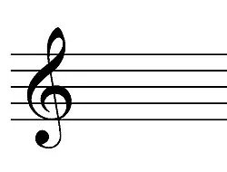

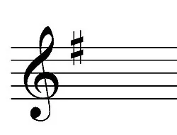
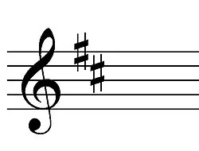
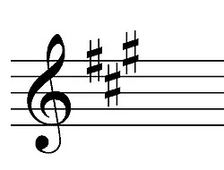
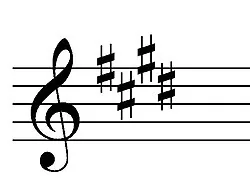
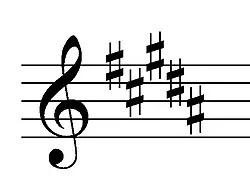
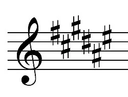

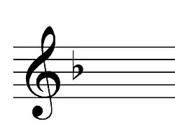
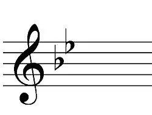
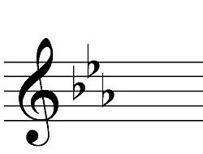
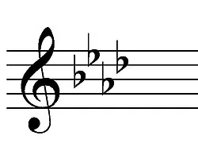
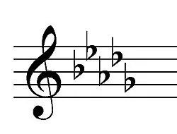
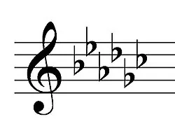

### Derivation

This procedure requires modular arithmetic. For example, `n % 12` is the remainder after dividing `n` by 12.

#### 1. Derive the circle of fifths (optional)

##### 1.1 Count up or down from C by perfect fifths

Each note in the circle of fifths is a perfect fifth (seven semitones) above the previous, so start at C and count up or down by multiples of seven semitones:

`-42, -35, -28, -21, -14, -7, 0, 7, 14, 21, 28, 35, 42`

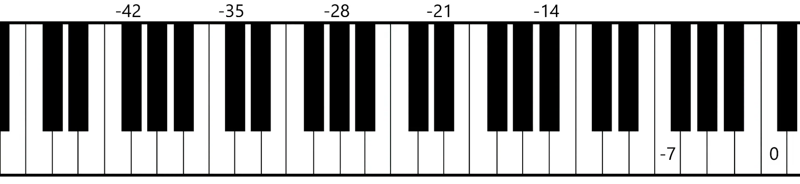
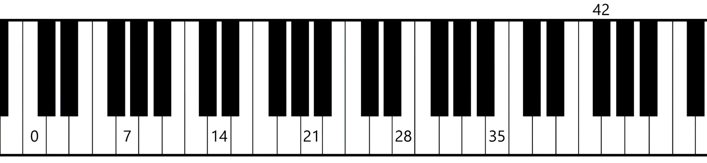

##### 1.2 Perform mod 12 on the multiples of 7

Since there are 12 notes in the octave, performing mod 12 on the semitone distance of each note from C returns the integer that labels the note or pitch class:

`6, 1, 8, 3, 10, 5, 0, 7, 2, 9, 4, 11, 6`

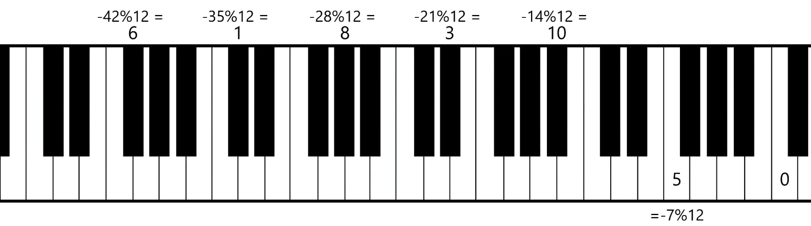
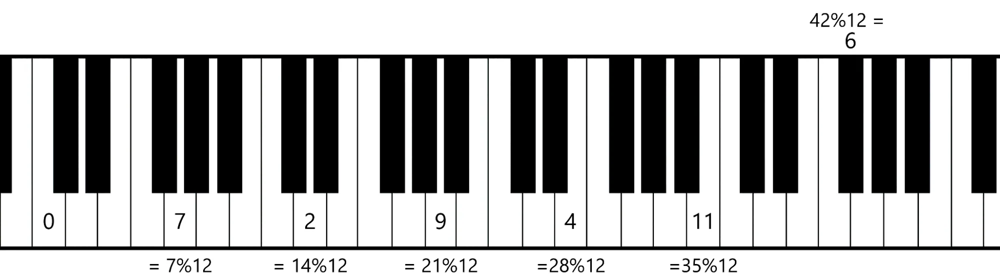

##### 1.3 Note number to letter name

Translate each note number back to the conventional note name using the numbering from the previous step. The linear congruence for determining a note's number, `n`, from the index in the circle of fifths, `a`, is:

`n ≡ 7a (mod 12)`

| Index, a       | -6      | -5      | -4      | -3      | -2      | -1  | 0   | 1   | 2   | 3   | 4   | 5   | 6       |
| -------------- | ------- | ------- | ------- | ------- | ------- | --- | --- | --- | --- | --- | --- | --- | ------- |
| Multiple of 7  | -42     | -35     | -28     | -21     | -14     | -7  | 0   | 7   | 14  | 21  | 28  | 35  | 42      |
| Note number, n | 6       | 1       | 8       | 3       | 10      | 5   | 0   | 7   | 2   | 9   | 4   | 11  | 6       |
| Note name      | F♯ / G♭ | C♯ / D♭ | G♯ / A♭ | D♯ / E♭ | A♯ / B♭ | F   | C   | G   | D   | A   | E   | B   | F♯ / G♭ |

#### 2. Numerical circle of fifths

Replace the note letter names in the circle of fifths with their corresponding numbers. Replace the sharps and flats with positive and negative numbers. The outside numbers on the right of that integer circle correspond to the multipliers from step 1.1, and the inside numbers correspond to the note labels from step 1.2.

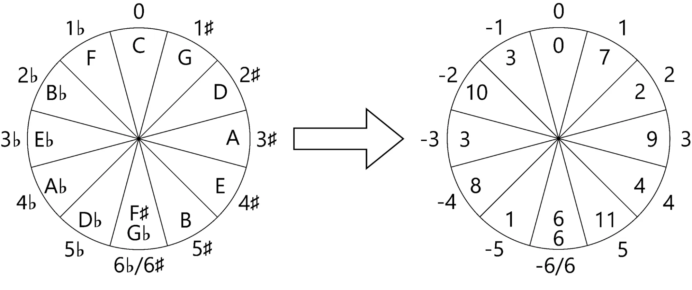

#### 3. The pattern in n - a differences

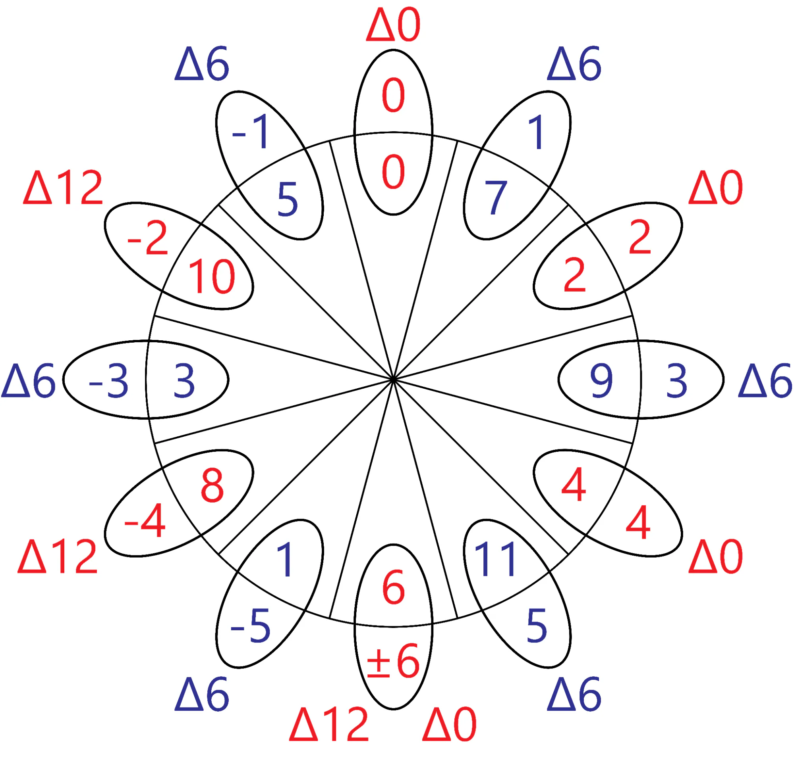

`a` is the number of accidentals. `n` is the tonic note number. `Δ` is the difference `n - a`.

| a   | n   | n - a |
| --- | --- | ----- |
| -6  | 6   | 12    |
| -5  | 1   | 6     |
| -4  | 8   | 12    |
| -3  | 3   | 6     |
| -2  | 10  | 12    |
| -1  | 5   | 6     |
| 0   | 0   | 0     |
| 1   | 7   | 6     |
| 2   | 2   | 0     |
| 3   | 9   | 6     |
| 4   | 4   | 0     |
| 5   | 11  | 6     |
| 6   | 6   | 0     |

- For odd `a`, `n - a` is always 6.
- For even `a`, `n - a` is 0 when `n ≤ 6`, and 12 when `n ≥ 6`.

In modulo 12, the relationship for evens is even simpler, since `12 ≡ 0 (mod 12)`.

An interesting pattern is that the even notes and odd notes in the circle of fifths are sequential:

- Even notes start at index `a = 0` and go clockwise in the order 0, 2, 4, 6, 8, 10.
- Odd notes start at index `a = -5` (or +7) and go clockwise in the order 1, 3, 5, 7, 9, 11.

Whenever I have to draw a circle of fifths, I write all of the even notes first, and then all of the odd notes.

#### 4. Accidentals count, a, to major-key tonic note, n

The pattern is represented by the formula:

- If `a` is odd, then `n = 6 + a`.
- If `a` is even and `a ≥ 0`, then `n = a`.
- If `a` is even and `a < 0`, then `n = 12 + a`.

The integer 6 represents the note F♯ / G♭, so when `a` is odd, the formula can be interpreted as the note F♯ / G♭ plus the number of sharps, or minus the number of flats.

The integers 0 and 12 both represent the note C, so when `a` is even, the formula can be interpreted as the note C plus the number of sharps, or minus the number of flats.

Because the notes 0 and 6 seem to be special reference notes for even and odd notes, I will sometimes refer to the notes C and F♯ / G♭ as "landmark notes."

#### 5. Major-key tonic note, n, to accidentals count, a

As far as going from the note, `n`, back to the number of accidentals, `a`, is concerned, I personally visualize a keyboard and just reverse the trick that I use to go from `a` to `n`. That is, I look at the note, find the nearest landmark note depending on whether `n` is even or odd, and count backwards. If the note I am looking at is odd, then I look at how many semitones away from F♯ / G♭ the note is. If the note is even, then I look at how many semitones away from C the note is, depending on what side of F♯ / G♭ the note is on. If you have to go down from F♯ / G♭ or C to get to the note you are looking at, then the key signature contains flats. If you have to go up from F♯ / G♭ or C to get to the note you are looking at, then the key signature contains sharps.

As far as practical information goes, that is all I have for `n` to `a`, but just for fun and completion, the linear equation for `a` to `n` can be solved to go from `n` to `a`.

The linear modular equation used to solve for `n` given `a` is:

`n ≡ 7a (mod 12)`

To go the other way, solve the linear equation for `a`.

1. Find the multiplicative inverse of 7, `7⁻¹`, in modulo 12. This exists because the coprimality condition for modular inverses is met (from Bézout's Identity). That is, 7 and 12 are coprime: `gcd(7, 12) = 1`. `7⁻¹` is found using the extended Euclidean algorithm (not shown):

   `7⁻¹ ≡ -5 ≡ 7 (mod 12)`

   `7 * 7 = 49 ≡ 1 (mod 12)`

2. Multiply both sides of `n ≡ 7a (mod 12)` by `7⁻¹`:

   `7n ≡ a (mod 12)`

Alternatively, the pattern of the differences between `n` and `a` from step 4 can be written as:

- If `a` is even: `n = a (mod 12)`
- If `a` is odd: `n = 6 + a (mod 12)`

### Extra info

- The only mnemonic I have for remembering the integer labels of the notes is 9 = Asinine. Potentially "even" for E (note 4) and "Five" for F, but those are more tenuous.
- Conventional key signatures don't seem to mix both sharps and flats, so if your given key signature contains flats, then the resulting major key's tonic note will also be a flat (or natural). If your given key signature contains sharps, then the resulting major key's tonic note will also be sharp (or natural).
- Adding 7 accidentals to a major key signature raises the tonic by one semitone. For example, C has 0 sharps or flats. C♯ major has 7 sharps. C𝄪 would have 14 sharps. One implication of this is that `floor(|a| / 7)` can be used to calculate how many modifying accidentals belong on the tonic note. In conjunction with `mod(a, 7)` corresponding to how many sharps or flats belong on the staff, these functions extend the method outlined above to theoretical key signatures past the conventional 12.
- Adding 12 accidentals to a major key signature converts the tonic to the next higher enharmonic equivalent. For example, G♭ major has `a = -6`; F♯ major has `a = +6`.
- Sharp key signatures: the order of added sharp notes is F, C, G, D, A, E, B (Father Charles Goes Down And Ends Battle). The order of added scale degrees is 7, 3, 6, 2, 5, 1, 4.
- Flat key signatures: added flat notes are B, E, A, D, G, C, F (Battle Ends And Down Goes Charles's Father). The order of added flat scale degrees is 4, 1, 5, 2, 6, 3, 7.
