## Problem

A friend lives directly on the water; a family member likes to go sailing on a nearby river. Both wanted an easy way to see the tide at a glance. I had roughly one month, from the idea's conception in late November 2023 to completion in early January 2024, to design and assemble two solar-powered tide trackers as gifts.

The device plots tide height versus time for a given location and displays the plot on an e-ink display. The data comes from NOAA (the National Oceanic and Atmospheric Administration), refreshed every two hours.

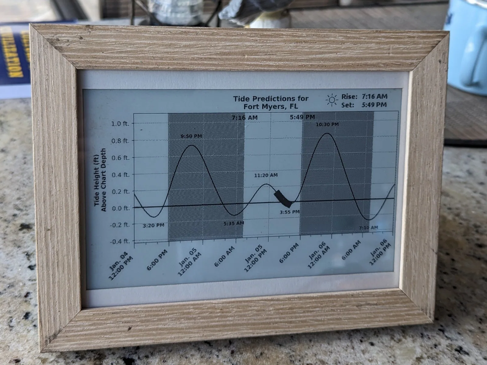
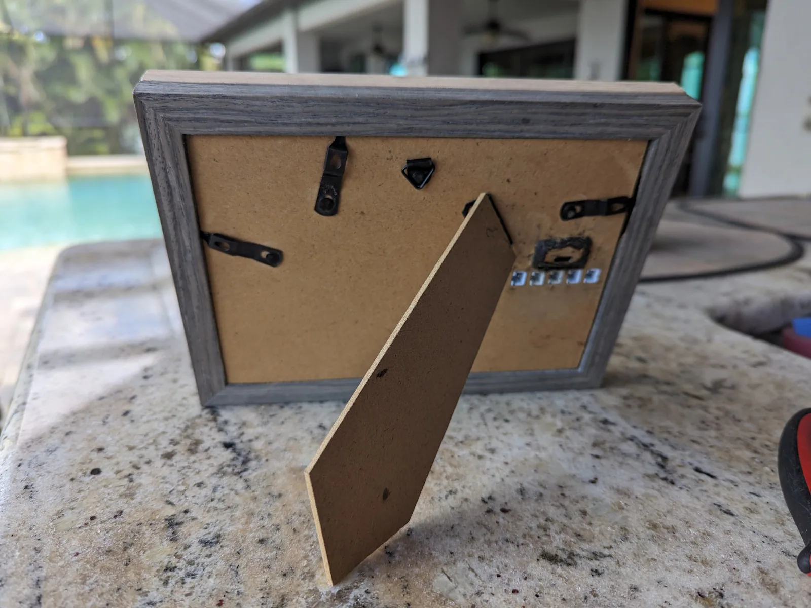

## Constraints

- **Monetary cost**: This constraint applies to most projects.
- **Aesthetics**: The display had to be large enough to be readable and stand out, but not so large as to be prohibitively expensive. I used a black-and-white e-ink display rather than a multicolor one for cost and simplicity, and built a frame to enclose the electronics.
- **Solar powered**: It seemed natural for a device that tracks tides to be solar powered. Being low-power also means it can run on battery alone, making it portable.
- **Time frame**: The idea came together in September 2023. I didn't have materials until Black Friday in November, with a self-imposed deadline of Christmas.

I ended up building two units rather than one:

1. The two recipients live near different rivers.
2. The picture frames ship from Amazon as a four-pack at a low unit price. To fit all the components into one enclosure, I stacked and glued two frames together. Two frames matched the lighter, sandy color scheme of my friend's house; the other two matched the darker, rustic scheme of my family member's house.
3. Nearly 80% of the total time went into designing the physical layout and writing the code, a one-time cost. The work from the first unit could be reused for free on all subsequent units, aside from parts and assembly time.

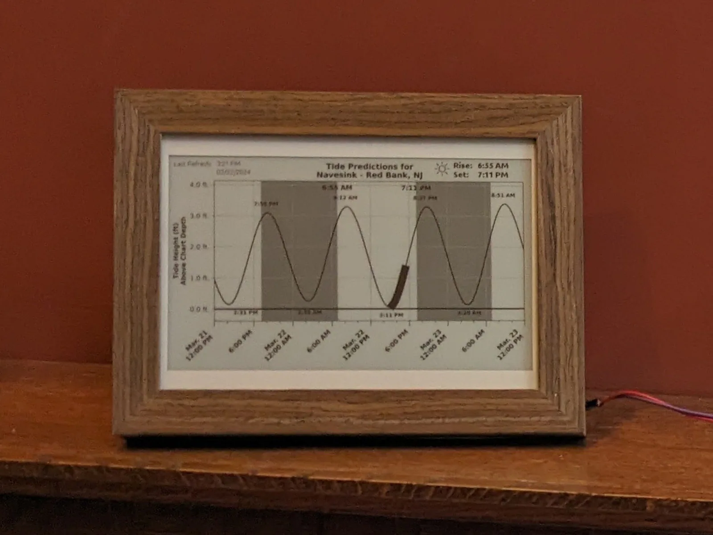
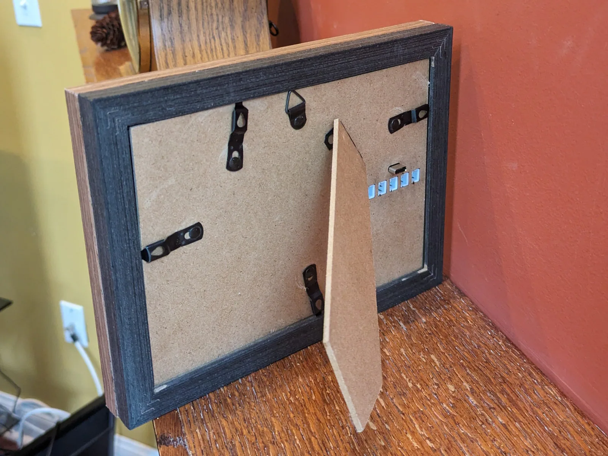

## Approach

The plot below is a snapshot of the tides in Fort Myers, FL on January 5, 2024.

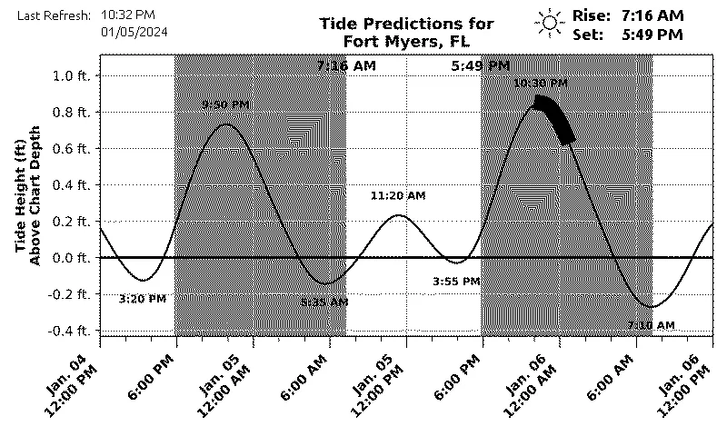

A few notes on reading the chart:

- The **y-axis** is tide **height**; the **x-axis** is time.
- The **black bar** along the curve marks the section corresponding to "now."
- **Light regions** represent daytime; **dark shaded regions** represent nighttime.
- When midnight passes, the graph shifts so the center always shows noon of "today."
- **Sunrise** and **sunset** are shown in the upper-right corner and on the plot itself.
- **High tide** and **low tide** times are labeled near the corresponding peaks and valleys.

Height is measured relative to the mean lower low water (MLLW) level. That is, the average low tide over roughly the past 19 years. "Now" is represented as a sweep along the curve rather than a single point, since a continuously refreshed point would defeat the purpose of a low-power, two-hour refresh interval.

### Power

The tracker runs on a 4500mAh LiPo battery and can go several days unattended. It charges over USB-C, with five JST connectors for solar panels.

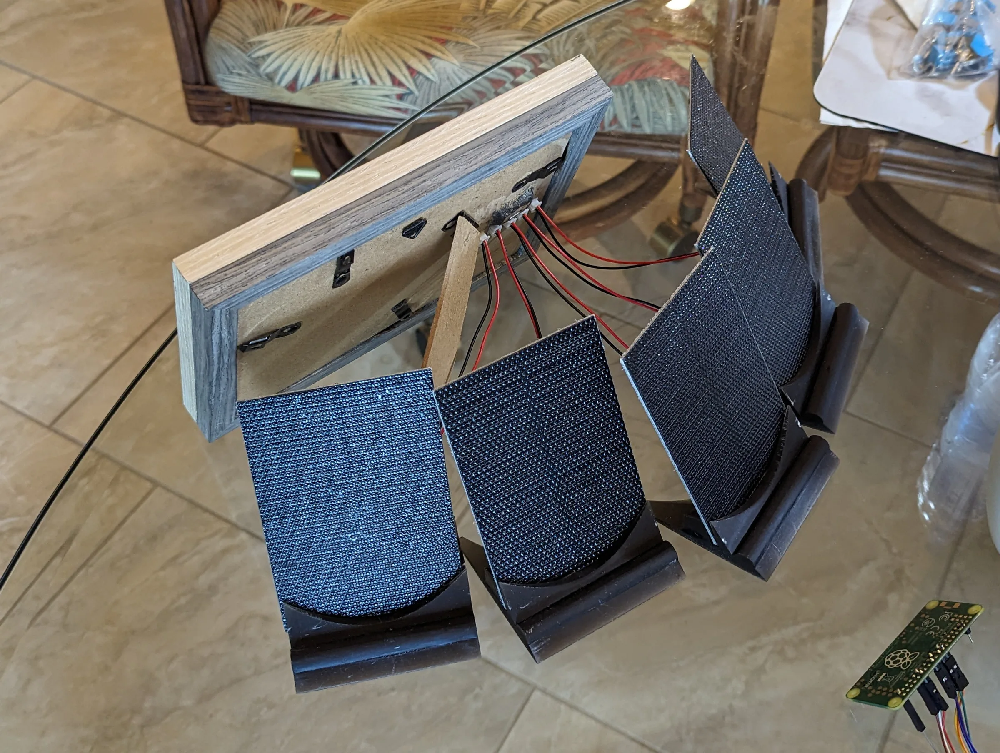
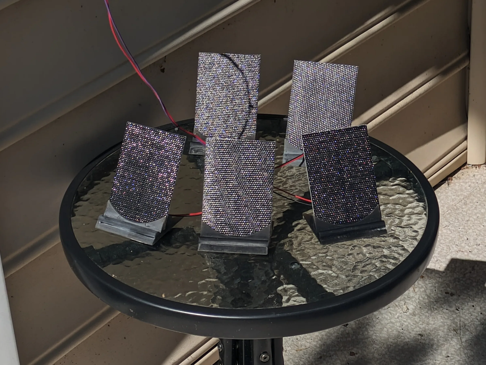

I also designed and resin-printed custom stands for the solar panels:

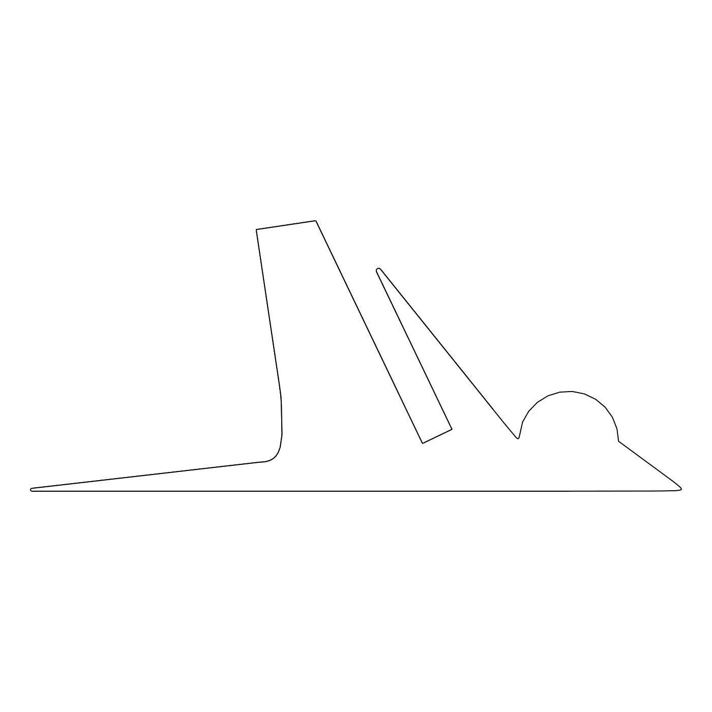
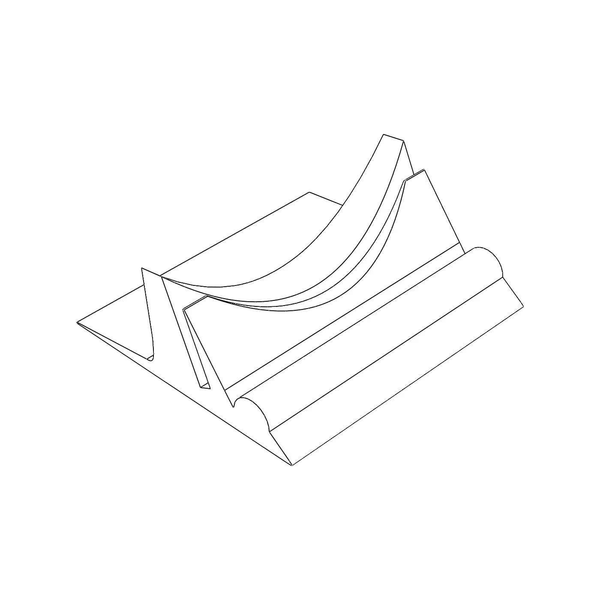

### Extensibility: changing location or network

What if my friend moves, or changes their Wi-Fi? I built a configuration webpage hosted on the device itself, and the internals leave room to reach the setup switch without disassembling the frame.

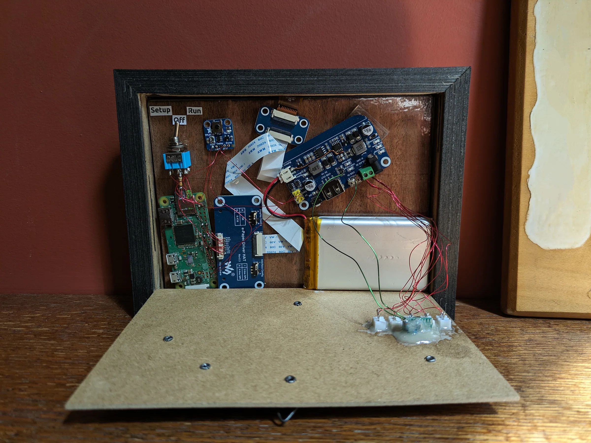

If the device loses its Wi-Fi connection, an error screen appears:

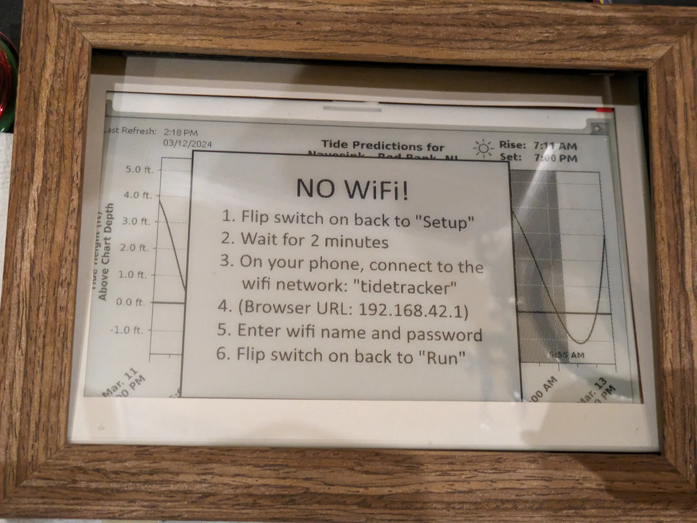
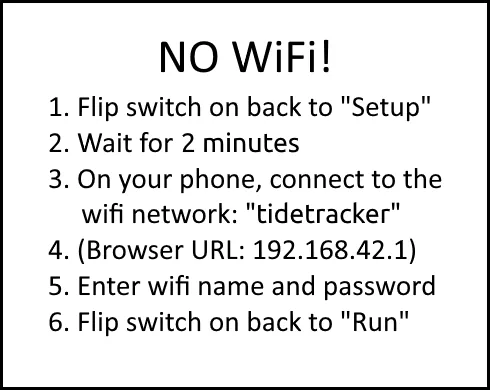

Flipping the internal setup switch boots the Raspberry Pi into a mode that broadcasts its own Wi-Fi hotspot and hosts the settings page:

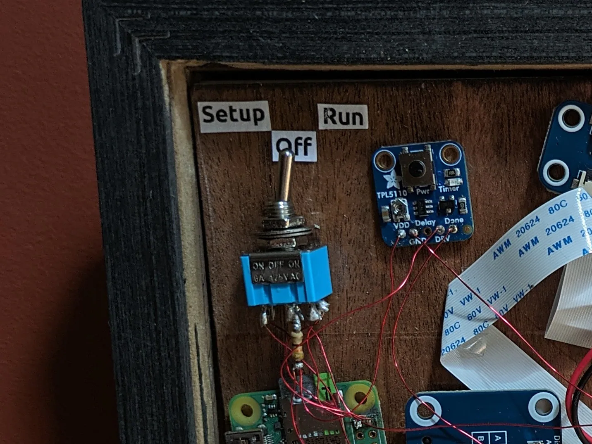

From a phone, the "tide-tracker" network becomes visible:

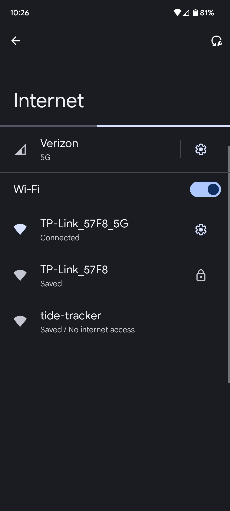

Connecting opens a configuration page for entering Wi-Fi credentials and the NOAA station to track.

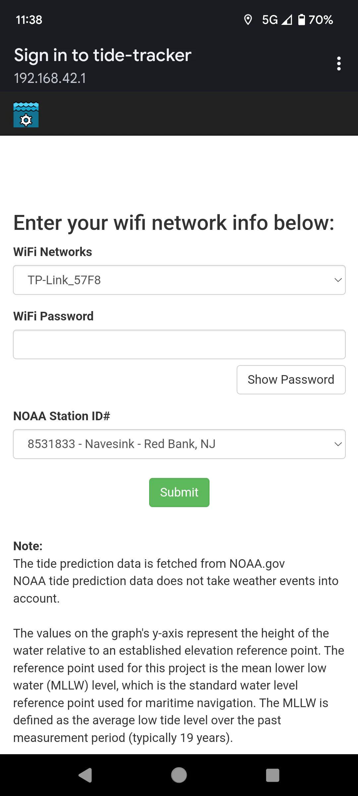
